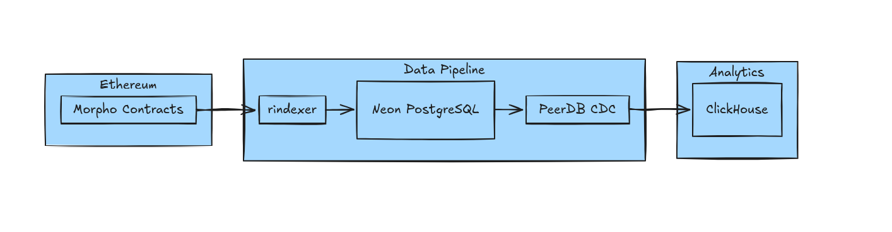

# morpho-streaming-data-pipeline



The Morpho data pipeline indexes Morpho Blue, Public Allocator, Metamorpho FlagshipETH, Metamorpho FlagshipUSDC and Metamorpho Factory contracts data to clickhouse. The pipeline begins with rindexer, which automatically tracks and indexes events from multiple Morpho contracts on the Ethereum blockchain. This data is immediately stored in a Neon PostgreSQL database. PeerDB continuously captures changes from PostgreSQL using Change Data Capture (CDC) and streams this data to ClickHouse.


## Project Documentation

This documentation covers the configuration structure and components and data architecture required to set up and run the indexer.
Configuration Structure

## rindexer Configuration
```
name: morphoIndexer
project_type: no-code
description: Morpho contracts data indexer
```

The root configuration identifies the project and its type.
Network Configuration
```
networks:
- name: ethereum
  chain_id: 1
  rpc: "${ETH_RPC_URL}"
```

Specifies the blockchain network(s) to index
Uses environment variables for RPC endpoint configuration
Currently configured for Ethereum mainnet (chain ID: 1)

Storage Configuration
```
storage:
  postgres:
    enabled: true
```

Defines the data storage solution
PostgreSQL is enabled as the primary database

## Contract Configurations
The indexer tracks multiple Morpho-related contracts:

### Morpho Blue
```
Address: 0xbbbbbbbbbb9cc5e90e3b3af64bdaf62c37eeffcb
Block Range: 18883124 - 21110017
ABI Path: ./abis/Morpho.abi.json
```

### Public Allocator
```
Address: 0xfd32fa2ca22c76dd6e550706ad913fc6ce91c75d
Block Range: 19375099 - 21110017
ABI Path: ./abis/PublicAllocator.abi.json
```

### Flagship USDC
```
Address: 0x186514400e52270cef3d80e1c6f8d10a75d47344
Block Range: 18971966 - 21110017
ABI Path: ./abis/FlagshipUSDC.abi.json
```

### Flagship ETH
```
Address: 0x38989bba00bdf8181f4082995b3deae96163ac5d
Block Range: 18927491 - 21110017
ABI Path: ./abis/FlagshipETH.abi.json
```


### MetaMorpho Factory
```
Address: 0xa9c3d3a366466fa809d1ae982fb2c46e5fc41101
Block Range: 18925584 - 21110017
ABI Path: ./abis/MetaMorphoFactory.abi.json
```


Global Configuration
```
global:
  etherscan_api_key: ${ETHERSCAN_API_KEY}
```

Defines global settings applicable across the indexer
Uses environment variable for Etherscan API key

### Environment Variables Required
The following environment variables must be set:

ETH_RPC_URL: Ethereum RPC endpoint URL

ETHERSCAN_API_KEY: API key for Etherscan

## Deplyment
rindexer is deployed on railway using the railway deployment guide.


## Neon PostgresSQL Source Setup
Database User and Permissions

```
-- Create PeerDB user
CREATE USER peerdb_user PASSWORD 'your_secure_password';

-- Grant necessary permissions
GRANT USAGE ON SCHEMA "public" TO peerdb_user;
GRANT SELECT ON ALL TABLES IN SCHEMA "public" TO peerdb_user;
ALTER DEFAULT PRIVILEGES IN SCHEMA "public" GRANT SELECT ON TABLES TO peerdb_user;

-- Enable replication for user
ALTER USER peerdb_user REPLICATION;

-- Create publication for CDC
CREATE PUBLICATION peerdb_publication FOR ALL TABLES;
```
#### Enable Logical Replication

Navigate to Neon console Settings → Logical Replication
Enable logical replication
Verify settings:
```
SHOW wal_level; -- Should return 'logical'
SHOW max_wal_senders; -- Should return 10
SHOW max_replication_slots; -- Should return 10
```
##  ClickHouse Setup
Database and User Setup
```
-- Create database
CREATE DATABASE peerdb;

-- Create PeerDB user
CREATE USER peerdb_user IDENTIFIED BY 'your_secure_password';

-- Grant necessary permissions
GRANT INSERT, SELECT, DROP, CREATE TABLE ON peerdb.* to peerdb_user;
GRANT CREATE TEMPORARY TABLE, s3 on *.* to peerdb_user;
GRANT ALTER ADD COLUMN ON peerdb.* to peerdb_user;
```
### PeerDB Mirror Setup
Mirror Configuration

Navigate to PeerDB UI → Mirrors tab → New Mirror
Configure the mirror:
Mirror Type: CDC
Mirror Name: morpho_neon_to_clickhouse
Source: Neon PostgreSQL
Destination: ClickHouse Cloud

Configuration:
- Initial Snapshot: true
- Sync Interval: 20 seconds
- Publication Name: peerdb_publication